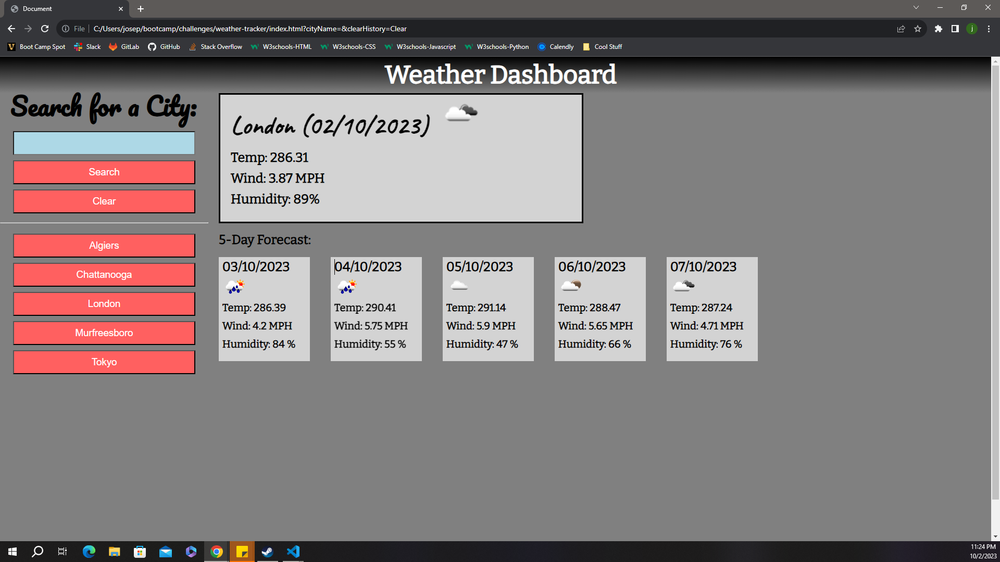

# weather-tracker
A dashboard to display the current weather at certain locations

## Description

 - I wanted challenge myself to create a dashboard to display the current weather at certain locations for travel planning.

## Table of Contents

  - [Credits](#credits)
  - [Badges](#badges)
  - [Features](#features)
  - [Questions](#questions)
  - [Screenshot](#screenshot)
  - [DeployedApp](#deployedApp)

## Credits

 - This website was coded by Joseph Dakota Johnson.

 - Instructor Caleb Crum helped me during class by showing me ways to add the buttons of past searches. He also helped me figure out how to pull from the local storage for the button's searches. [Caleb's GitHub account](https://github.com/CalebCrumInstructor)

 - Tutor Alexis Gonzalez helped me during a tutoring session by helping me figure out the correct perspective to think on when checking the implementation and implementing coding and by helping me figure out how to pull from an API appropriately.

 - My brother (boot camp graduate) helped out by helping me get started on creating my variables for saving to local storage, helping me figure out the alert if the user's input is invalid, and helping me create the clear button. [Dylan's GitHub account](https://github.com/dylanstormjohnson)

## Badges

 - 
 - 
 - 
 - 
 - 
 - 

## Features

 - When the user types in a name of a city and clicks the search button, they will
    be presented with the current day's icon, temperature, wind, and humidity and a forecast of the next five days forecast.
 - Then, the user's response is recorded and displayed below in another button that
    can be clicked to re-display the weather again from local storage
 - If the user inputs and invalid city, they will be met with an alert that tells
    them that their answer is invalid.
 - When the user clicks the clear button, the local storage will be cleared.
 - There is a super hidden secret easter egg that will be hard to find.

## Questions

 - If you have any questions for me, my GitHub account is [Dakota's GitHub account](https://github.com/josephdakotajohnson)
 
## Screenshot

 - This is a screenshot of the application: .
 
## DeployedApp

 - This is a link to the fully deployed application: (https://josephdakotajohnson.github.io/weather-tracker/).